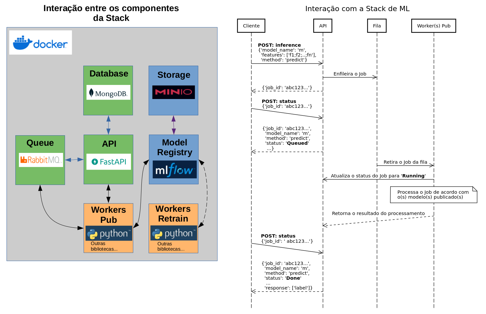
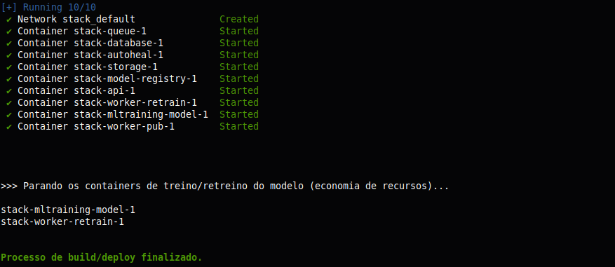
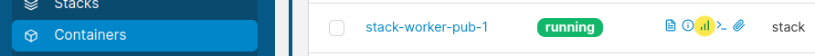
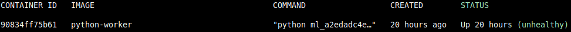
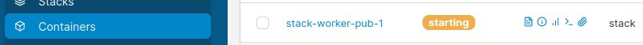
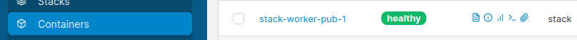
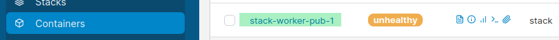
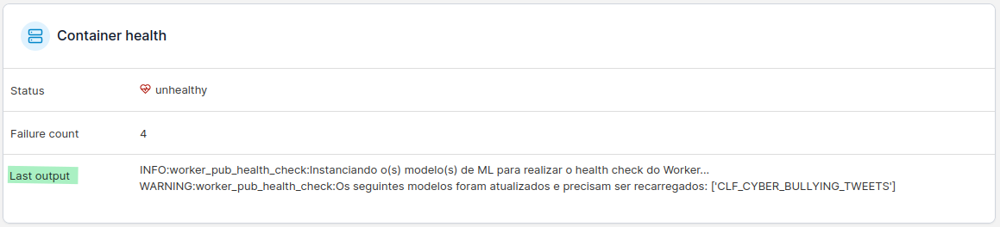

# Stack de ML (*Machine Learning*) - Prodest

Repositório para distribuição da Stack de ML do Prodest. A finalidade desta Stack é possibilitar a publicação de modelos de ML de forma padronizada através de APIs.

Essa é uma versão **standalone** da Stack que pode ser utilizada para rodá-la no seu próprio computador, para 
**realização de testes** de utilização da Stack e testes de publicação de modelos de ML.

**IMPORTANTE:** Este procedimento de *deploy* baseia-se em um modelo de testes que está disponível [**aqui**](https://github.com/prodest/modelo-teste).
Entretanto, se o intuito é testar um modelo próprio, é necessário utilizar a biblioteca [**mllibprodest**](https://pypi.org/project/mllibprodest/) (também disponível [aqui](https://github.com/prodest/mllibprodest)) 
e adaptar o código do seu modelo de acordo com as premissas definidas pela biblioteca.

---

### Descrição dos componentes da Stack e interações.

**Componentes.** São implementados através de containers utilizando o [Docker](https://www.docker.com/):

- **API**: Recebe as requisições das aplicações clientes; gera os Jobs; e os enfileira para que os 'Workers Pub' os retirem da fila e processem.
- **Queue**: Recebe os Jobs gerados pela API e os organiza em filas. Os 'Workers Pub' retiram estes Jobs das 
respectivas filas; realizam o processamento; e enviam os resultados diretamente para API, sem enfileirá-los.
- **Database**: Armazena os Jobs gerados pelas requisições das aplicações clientes. Também guarda a estrutura que define qual fila um determinado Worker consumirá.
- **Storage**: Local onde o 'Model Registry' persiste os artefatos dos modelos registrados.
- **Model Registry**: Componente onde os modelos e seus artefatos são registrados para serem utilizados pelos Workers Pub e Retrain.
- **Worker Pub**: Utiliza os modelos registrados para atender aos Jobs gerados e enfileirados pela API, provenientes das requisições das aplicações clientes.
- **Worker Retrain**: Avalia periodicamente os modelos registrados e, se necessário, faz o retreino e registra o novo modelo
no 'Model Registry'. Entretanto, o modelo não entra em produção automaticamente. Antes, deve ser revisado pelo desenvolvedor responsável pelo modelo, 
e se for o caso, colocado em produção (conforme explicado no **passo 2**, mais adiante).

**NOTA:** Por conta das especificidades de cada modelo de ML, a implementação dos workers **Pub** e **Retrain** é de responsabilidade do desenvolvedor do modelo que deve seguir a padronização
definida na biblioteca de ML do Prodest ([**mllibprodest**](https://pypi.org/project/mllibprodest/)).

**Interações:**

A imagem abaixo ilustra as interações entre os componentes da Stack (à esquerda); e entre a aplicação cliente e a Stack (à direita). 
Cabe observar que:

- Nem todos os componentes da Stack se comunicam, por exemplo, somente a **API** interage com o componente **Database**. Por outro 
lado, o **Model Registry** não se comunica com o componente **Database** nem com o **Queue**.
- Os workers **Retrain** não se comunicam com a **API**.
- Apesar de não estar representado na imagem (para simplificar), os workers **Pub** e **Retrain** se comunicam com o 
componente de **Storage** para salvar os artefatos na rotina de registro dos modelos.
- A interação entre a aplicação cliente e a Stack acontece assincronamente, onde a aplicação cliente envia a requisição para a API
e recebe o ID do Job para consultar o *status* posteriormente. Dessa forma, a aplicação cliente não ficará bloqueada aguardando 
retorno da API.
- As requisições de **status** e para **feedback** são atendidas diretamente pela API, ou seja, não há necessidade de enfileiramento.

**NOTA:** Também para simplificar, nem todas as interações da aplicação cliente com a API foram representadas, porém, a lógica é a mesma
para a maioria das interações: O cliente envia a requisição; recebe o ID do Job; e consulta posteriormente para verificar se o processamento
do job terminou, caso tenha terminado, recebe a resposta.



---

### Pré-requisitos.

- Computador com sistema Linux; ou Windows utilizando [**WSL - Windows Subsystem for Linux**](https://learn.microsoft.com/pt-br/windows/wsl/install).
- **Python >= 3.10.** Instruções: [Linux (Geralmente já vem instalado por padrão)](https://python.org.br/instalacao-linux) ou [Windows](https://www.python.org/downloads/windows).
- [**Docker**](https://docs.docker.com/get-started/overview): Caso ainda não possua em seu computador, será necessário instalar. **DICA:** 
Instale o **Docker** dentro do Linux do WSL, utilizando o procedimento, por exemplo, para o [**Ubuntu**](https://docs.docker.com/engine/install/ubuntu/)
(distribuição padrão do WSL). Caso tenha escolhido outra distribuição, utilize o procedimento específico para ela 
([**escolha aqui**](https://docs.docker.com/engine/install/#server)).

**NOTA:** Se o seu computador navega na Internet através de um [**proxy**](https://pt.wikipedia.org/wiki/Proxy), será 
necessário fazer estas configurações: no [**Linux (WSL)**](https://linuxstans.com/how-to-set-up-proxy-ubuntu/) e 
[**Docker**](https://docs.docker.com/network/proxy/#configure-the-docker-client), ambas via linha de comando. Porém, alterando as configurações conforme 
as informações do proxy da sua rede e de suas credenciais de usuário, caso o proxy solicite autenticação.

### (Opcional) Provisionar o Portainer.

O [**Portainer**](https://www.portainer.io/get-started) é, em resumo, uma interface WEB para gerenciamento de ambientes Docker. Caso queira simplificar a gestão dos 
containers da Stack e não se ater muito à linha de comandos do Docker, provisione o Portainer. Para isso será preciso 
rodar os comandos Docker abaixo (não dá para fugir totalmente da linha de comando!):

Crie o volume para o Portainer persistir os dados.
```bash
docker volume create portainer_data_4a75ef64b5
```
Provisione o Portainer.
```bash
docker run -d -p 8000:8044 -p 9443:9443 --name portainer_4a75ef64b5 --restart=always -v /var/run/docker.sock:/var/run/docker.sock -v portainer_data_4a75ef64b5:/data portainer/portainer-ce:latest
```
Depois do *deploy*, acesse o Portainer: https://localhost:9443 

Para fazer o setup inicial siga as instruções em: https://docs.portainer.io/start/install-ce/server/setup

Depois do setup inicial, na tela principal (**Quick Setup**); clique em '**Get Started**' e em seguida clique em '**local**' (fica ao lado da logo azul do Docker). 
Do lado esquerdo da tela clique em '**Containers**', para visualizar os containers que estão rodando no computador (observe que o próprio Portainer é um container!).

**NOTA:** O procedimento para subir a Stack é baseado na linha de comandos do Docker e Shell Script, porém os comandos já estão prontos 
e apenas será preciso copiar e colar. Adicionalmente, utilizando o Portainer, será mais fácil acompanhar os containers rodando 
no ambiente e executar atividades simples de *start* / *stop* / *restart*; verificar gráficos de utilização
e logs dos containers, etc. Explore a interface do Portainer e veja as possibilidades de uso!

---

## 1. Construir a Stack

### 1.1. Clonar o repositório 'prodest-ml-stack'.

Clone a *release* mais atual. 
```bash
git clone https://github.com/prodest/prodest-ml-stack.git
```

Ou, se for **extremamente necessário**, escolha outra mais antiga. No comando abaixo, substitua **1.6.8** (que é a tag 
da *release* mais atual) pela **tag** da *release* que deseja clonar.
```bash
git clone -b 1.6.8 --single-branch https://github.com/prodest/prodest-ml-stack.git
```
**ATENÇÃO:** Se for fazer os testes utilizando um modelo próprio; ou um que foi disponibilizado para publicação:
- Descompacte o arquivo 'publicar.zip';
- Copie a pasta **publicar** (a pasta toda, não somente o conteúdo dela) para dentro da pasta **prodest-ml-stack**;
- Ao seguir o passo **1.2**, responda '**no**' para a pergunta '**Deseja clonar e utilizar o modelo de exemplo...**', feita pelo *script* **build.sh**, 
e continue seguindo as instruções dele.

### 1.2. Construir as imagens e subir o ambiente.
```bash
cd prodest-ml-stack
```

```bash
./build.sh
```
Se o processo de *build* ocorrer com sucesso, no final você terá uma tela conforme abaixo. Caso o processo falhe, 
acompanhe as mensagens de erro e atenda ao que for solicitado. Em caso de erro, o *script* **build.sh** fará uma limpeza do 
ambiente para evitar que containers e imagens que foram criados no processo e não estão sendo utilizados, fiquem ocupando 
espaço no seu computador.



**NOTA:** Obtenha as credenciais para acesso aos recursos da *Stack* através do arquivo **'credentials_stack.txt'**. Ele se encontra no caminho: **'../temp_builder/'** (considerando que a pasta atual seja **'Stack'**).

### 1.3. Seguir os logs para acompanhar o uso da Stack.
Abra outro terminal; entre na pasta criada no processo de clonagem do repositório e rode os comandos de lá. Dessa forma você conseguirá seguir os passos em um terminal e acompanhar os logs em outro.

```bash
cd stack
```
```bash
./docker-compose logs -f --tail 1 &
```

## 2. Treinar um modelo para colocar em produção

Considerando que: A rotina de treinamento é executada esporadicamente; e que a economia de recursos computacionais é bem-vinda; 
os containers **stack-mltraining-model-1** (treinamento) e **stack-worker-retrain-1** (retreino) estão parados e deverão ser 
iniciados somente para fazer o treino/retreino e, logo após, serem parados novamente.

Ao executar o comando abaixo, o container é iniciado; o treino é executado; e o container é parado.
```bash
docker start stack-mltraining-model-1 && docker exec stack-mltraining-model-1 python /training_model/train.py && docker stop stack-mltraining-model-1
```

**Se o treino/retreino forem ok, uma mensagem informando o sucesso será exibida na tela.**

**ATENÇÃO:** Se o **treino** e/ou **retreino** derem erro por falta de capacidade de memória RAM/CPU (o script simplesmente para sem apresentar a mensagem de sucesso), acesse a console do container de treinamento, conforme passo 
opcional **2.2**, edite o arquivo '**configs.py**' e altere o parâmetro '**qtd_exemplos**' de 50000 para um valor menor que possibilite que o 
seu computador rode o exemplo de modelo.

```bash
nano configs.py
```
Para sair do editor **nano**: Pressione **CTRL+x**; digite **y** e pressione **ENTER** para salvar as alterações.

Após alterar a configuração, saia do container (exit); **rode novamente** o comando para realizar o treino; registre o novo modelo
e altere o **'Stage'** para **'Production'**.

### 2.1. Registre o modelo treinado:

- Acesse o MLflow (http://localhost:5000) e clique no experimento **CLF-Cyberbullying_Tweets**;
- Clique no link para o experimento que está na coluna **'Run Name'**;
- Clique no botão **'Register Model'** e escolha a opção **'Create New Model'**;
- Dê o nome **CLF_CYBER_BULLYING_TWEETS** para o modelo e clique em **'Register'**;
- Na barra superior clique em **'Models'**;
- Clique no link para a última versão do modelo que está em **'Latest Version'**;
- Na opção **'Aliases'**, clique em **'Add'**;
- Digite ***production*** e clique em **'Save aliases'**.

### 2.2. (Opcional) Acessar a console do container de treinamento.

Rode o comando abaixo para acessar a console do container.
```bash
docker start stack-mltraining-model-1 && docker exec -it stack-mltraining-model-1 bash
# Altere configurações; verifique logs; rode os comandos que desejar; etc.
```
Após encerrar a utilização, rode os comandos para sair e parar o container.
```bash
exit
docker stop stack-mltraining-model-1
```

## 3. Testar a API

### 3.1. Acesse o RabbitMQ (http://localhost:15672)
Utilize as credenciais criadas no processo de *deploy* da *Stack* para acessar; clique em '**Queues and Streams**' e verifique que ainda NÃO existem filas criadas.

### 3.2. Reinicie o serviço worker-pub.

Este serviço subiu, mas depois caiu porque o modelo, que nesse exemplo é **CLF_CYBER_BULLYING_TWEETS**, ainda não 
havia sido treinado e registrado no MLflow.

Certifique-se de que a pasta atual seja **prodest-ml-stack**; e execute o comando para entrar na pasta *stack*.
```bash
cd stack
```
Rode o comando para subir o serviço.
```bash
./docker-compose restart worker-pub
```

Consulte **novamente** a aba '**Queues and Streams**' e perceba que: após o reinício do serviço worker-pub, uma fila foi criada.

### 3.3. Faça as requisições para testar a interação com a API.

Substitua os valores das chaves abaixo, que serão usadas nas chamadas utilizando o [**client curl**](https://curl.se/download.html), como segue:

- **'Authorization'**: substitua COLE_AQUI_O_TOKEN pelo *token* de acesso à API (está no arquivo *'credentials_stack.txt'*).
- **'model_name'**: troque COLE_AQUI_O_NOME_DO_MODELO pelo nome do modelo que será utilizado para atender às requisições. Nesse exemplo, será **CLF_CYBER_BULLYING_TWEETS**
- **'job_id'**: altere COLE_AQUI_O_JOB_ID, conforme valor retornado nas requisições feitas à API.

Abra um prompt de comando ou terminal; copie e cole os exemplos a seguir (passos 3.3.x) para testar as requisições. Acompanhe 
os logs através do terminal aberto no passo **1.3**.

### 3.3.1. Teste o método 'predict'.

Envie esta requisição e observe o valor retornado na chave *'job_id'* para consultar o status utilizando o passo **3.3.2**.

```bash
curl -X 'POST' \
  'http://localhost:8080/inference' \
  -H 'accept: application/json' \
  -H 'Authorization: Bearer COLE_AQUI_O_TOKEN' \
  -H 'Content-Type: application/json' \
  -d '{
  "model_name": "COLE_AQUI_O_NOME_DO_MODELO",
  "features": [
    "yes exactly the police can murder black people and we can be okay with it because it’s in the past and they’re dead now."
  ],
  "method": "predict"
}'
```

### 3.3.2. Verifique o status do job.
Utilize o exemplo de requisição abaixo para obter o status/resposta referente ao processamento dos jobs.

```bash
curl -X 'POST' \
  'http://localhost:8080/status' \
  -H 'accept: application/json' \
  -H 'Authorization: Bearer COLE_AQUI_O_TOKEN' \
  -H 'Content-Type: application/json' \
  -d '{
  "job_id": "COLE_AQUI_O_JOB_ID"
}'
```

###  3.3.3. Verifique as informações do modelo.

Aqui também é preciso observar a chave *'job_id'* para consultar o status/resposta.

```bash
curl -X 'POST' \
  'http://localhost:8080/inference' \
  -H 'accept: application/json' \
  -H 'Authorization: Bearer COLE_AQUI_O_TOKEN' \
  -H 'Content-Type: application/json' \
  -d '{
  "model_name": "COLE_AQUI_O_NOME_DO_MODELO",
  "method": "info"
}' 
```

###  3.3.4. Avalie o modelo.

Observe a chave *'job_id'* para consultar o status/resposta.

```bash
curl -X 'POST' \
  'http://localhost:8080/inference' \
  -H 'accept: application/json' \
  -H 'Authorization: Bearer COLE_AQUI_O_TOKEN' \
  -H 'Content-Type: application/json' \
  -d '{
  "model_name": "COLE_AQUI_O_NOME_DO_MODELO",
  "features": [
    "Today’s society so sensitive it’s sad they joke about everything but they take out the gay jokes before race, rape, and other 'sensitive' jokes",
    "aposto que vou sofrer bullying depois do meu próximo tweet"
  ],
  "targets": [
    "gender",
    "not_cyberbullying"
  ],
  "method": "evaluate"
}'
```

###  3.3.5. Informe o feedback para o modelo.

O campo '**feedback**' deve ser preenchido com um ou mais labels que o usuário acredita que estão corretos. Os
labels devem ser os mesmos utilizados no treinamento (mesma escrita e tipo de 'caixa' das letras', *case sensitive*). 
No caso de um usuário perceber um label no qual o modelo não foi treinado, a instrução é procurar o responsável pelo modelo.

**NOTA:** A quantidade de labels dever ser a mesma respondida no retorno da requisição que gerou o *'job_id'* que está 
sendo consultado. Nesse exemplo específico, está sendo informado o feedback para o retorno da primeira requisição de teste (passo **3.3.1**). 

```bash
curl -X 'POST' \
  'http://localhost:8080/feedback' \
  -H 'accept: application/json' \
  -H 'Authorization: Bearer COLE_AQUI_O_TOKEN' \
  -H 'Content-Type: application/json' \
  -d '{
  "job_id": "COLE_AQUI_O_JOB_ID",
  "feedback": [
    "ethnicity"
  ]
}'
```
Nesse caso, não é gerado um *'job_id'*, pois a API responde diretamente.
###  3.3.6. Solicite as informações consolidadas sobre os feedbacks informados pelos usuários.

Observe a chave *'job_id'* para consultar o status/resposta, de acordo com passo **3.3.2**.

```bash
curl -X 'POST' \
  'http://localhost:8080/get_feedback' \
  -H 'accept: application/json' \
  -H 'Authorization: Bearer COLE_AQUI_O_TOKEN' \
  -H 'Content-Type: application/json' \
  -d '{
  "model_name": "COLE_AQUI_O_NOME_DO_MODELO",
  "initial_date": "dd/mm/yyyy",
  "end_date": "dd/mm/yyyy"
}'
```

**NOTA:** Também é possivel executar os seis testes anteriores (**3.3.x**) através da '**Swagger UI**' da API (http://localhost:8080/docs). Lembre-se de informar o *token* de acesso através do botão de autorização (ícone de cadeado aberto) antes de testar os *endpoints*.   

## 4. Testar o worker de retreino

O container **stack-worker-retrain-1** (retreino), assim como o de treinamento, deve ficar parado e ser iniciado somente 
para fazer o retreino e ser parado novamente.

Ao executar o comando abaixo, o container é iniciado; o retreino é executado; e o container é parado.
```bash
docker start stack-worker-retrain-1 && docker exec stack-worker-retrain-1 python /worker_retrain/retrain_46b1c135cdef278ddc3b2.py && docker stop stack-worker-retrain-1
```

**NOTA:** Caso deseje **automatizar esta rotina de retreino**, basta criar um agendamento no sistema operacional; incluir os comandos acima; e escolher a frequência
de execução (diária, semanal, etc.).

### 4.1. Verifique se uma nova execução do experimento foi criada:

- Acesse o MLflow (http://localhost:5000) e clique no experimento **CLF-Cyberbullying_Tweets**;
- Observe se na coluna **'Run Name'** tem uma execução chamada **'self_training'**.

Se a nova execução foi criada com sucesso, ela é passível de ser registrada (conforme descrito no passo **2.1**) como um novo modelo no estágio de 
produção, para ser utilizado pela API.


### 4.2. (Opcional) Acessar a console do container de retreino.

Rode o comando abaixo para acessar a console do container.
```bash
docker start stack-worker-retrain-1 && docker exec -it stack-worker-retrain-1 bash
# Verifique logs, rode os comandos que desejar, etc.
```
Após encerrar a utilização, rode os comandos para sair e parar o container.
```bash
exit
docker stop stack-worker-retrain-1
```

## 5. Passos opcionais

A execução desses passos não é necessária para o *deploy* da Stack, porém, caso você tenha interesse de explorar um pouco mais, 
siga em frente!

### 5.1. Para saber qual a versão da *Stack* que está em execução.
```bash
curl http://localhost:8080/version
```

### 5.2. Interação básica com o servidor de banco de dados.

Utilize os comandos abaixo para fazer uma verificação da utilização e dos dados salvos no banco de dados.

**NOTA:** Esses comandos são simples e permitem fazer uma interação bem básica com o banco de dados. Acesse a 
[documentação](https://docs.mongodb.com/manual/reference/method) completa para mais informações.

```bash
docker exec -it stack-database-1 bash
```

Utilize o cliente **mongosh** para abrir uma conexão com o banco (será solicitado a senha).
```bash
mongosh mongodb://localhost --username NOME_DO_USUÁRIO
```

Verifique o tamanho atual das bases de dados. Observe o tamanho da base '**ml_api_db**'.
```bash
show dbs
```

Rode os comandos abaixo para: Usar o banco de dados da API; listar todos os registros de fila; e listar todos os jobs gerados pelas chamadas à API. 
```bash
use ml_api_db
db.col_queue_registry.find({})
db.col_jobs.find({})
```

Verifique a quantidade de jobs que estão armazenados.
```bash
db.col_jobs.countDocuments()
```

Verifique os **4 últimos** jobs armazenados.
```bash
db.col_jobs.find().sort({$natural: -1}).limit(4)
```

**(Opcional)** Criação de um usuário, com permissão somente para leitura, para consulta dos dados. Copie o comando abaixo 
e cole na console do **mongosh**. Crie uma senha para o usuário, conforme solicitado.
```bash
db.createUser(
  {
    user: "ro_user",
    pwd:  passwordPrompt(),
    roles: [ { role: "read", db: "ml_api_db" }]
  }
)
```
Finalize a sessão do **mongosh**.
```bash
exit
```
Se você criou o usuário '**ro_user**', teste o *login* com o comando abaixo:

```bash
mongosh mongodb://localhost --authenticationDatabase 'ml_api_db' --username ro_user
```
Finalize a interação.

```bash
exit
exit # sai da console do container
```

### 5.3. Realizar um teste de stress simples na Stack.

Se o *deploy* da Stack ocorreu com sucesso e se você quiser saber o desempenho dela, dada certa carga de trabalho, execute 
as instruções abaixo para realizar um teste simples de *stress*.

- Abra a pasta '**prodest-ml-stack/optional**';
- Edite o arquivo de configuração '**test_configs.py**' e informe o *token* da API (leia os comentários do arquivo e, se desejar,
altere também outros parâmetros);
- Salve as alterações realizadas no arquivo '**test_configs.py**';
- Abra um prompt de comando ou terminal;
- Entre na pasta '**prodest-ml-stack/optional**';
- Crie e ative um ambiente virtual Python, conforme instruções: [Linux e Windows (escolha o sistema na página)](https://packaging.python.org/en/latest/guides/installing-using-pip-and-virtual-environments/#creating-a-virtual-environment);
- Atualize o pip e o setuptools;
- Instale o pacote requests;
```bash
pip install --upgrade pip setuptools
pip install requests==2.31.0
```
- Execute o script que fará o teste de *stress*; observe a execução e as mensagens na tela.

**NOTA:** Edite o script '**simple_stress_testing.py**' e leia os comentários no início dele para obter informações sobre as métricas utilizadas no teste.

```bash
python simple_stress_testing.py
```
Se você instalou o **Portainer**, utilize-o para monitorar as estatísticas dos containers durante o teste (principalmente as do Worker Pub).

- Do lado esquerdo da interface do Portainer, clique em **Containers** e em seguida clique no ícone (destaque em amarelo) 
para abrir as estatísticas do Worker Pub. Faça o mesmo para outros containers que você deseja monitorar.



Utilize o Portainer para monitorar logs; abrir a console dos containers; criar outras cópias dos Workers Pub para testar 
o desempenho; etc. Explore bem a interface!

**NOTA:** Dependendo da intensidade dos testes, por exemplo: valor de **DELAY** muito pequeno (verifique essa opção no arquivo 
de configuração '**test_configs.py**'), podem ocorrer reinicializações do container Worker Pub por conta de exaustão de 
recursos computacionais. Se isso ocorrer, diminua o valor do *delay* para que o Worker Pub consiga atender às 
requisições. Outra alternativa é aumentar a quantidade de Workers Pub através do Portainer (clique no container **stack-worker-pub-1**; 
depois clique na opção para 'Duplicar/Editar'; altere o nome para **stack-worker-pub-2** e clique no botão para fazer o 
depoly do container). Após o *deploy*, haverá uma cópia do Worker Pub para auxiliá-lo no atendimento das requisições. 

### 5.4. Entender os status do container Worker PUB.

No ciclo de vida do container **Worker PUB** estão previstos alguns *status* que são referentes às versões dos modelos que estão 
em produção. Estes *status* podem ser consultados:

Via linha de comando:

```bash
docker ps -a
```


Ou através do **Portainer**. Segue abaixo uma breve descrição de cada um desses *status*:

- **starting**: Indica que o container foi iniciado (já consegue processar os jobs), mas ainda não ocorreu a verificação 
das versões dos modelos. A primeira verificação ocorrerá, aproximadamente, 12 minutos após o início do container.



- **healthy**: O container foi iniciado e todos os modelos estão na sua versão mais atual. Este *status* será o padrão 
enquanto o container estiver rodando e os modelos estiverem atualizados.



- **unhealthy**: Indica que o container **Worker PUB** está rodando com um ou mais modelos desatualizados e precisa ser 
reiniciado para carregar os modelos atualizados.



Para verificar o motivo do *status* estar na condição **unhealthy**:

Via linha de comando:

```bash
docker inspect stack-worker-pub-1
```

Para obter os detalhes que levaram a este *status* **unhealthy**, procure na saida do comando acima pela chave **"Health": {**.

Utilizando o Portainer:

Clique no nome do container, conforme destacado em verde na figura anterior, e procure a seção '**Container health**'; 
na caixa '**Last output**', verifique a mensagem que informa o motivo do *status* está como **unhealthy**.



Caso o **Worker PUB** esteja com *status* **unhealthy**, rode o comando abaixo para reiniciar o container e carregar a 
versão mais atual dos modelos:

**NOTA:** Este comando deve ser executado de dentro da pasta **prodest-ml-stack/stack/**.
```bash
./docker-compose restart worker-pub
```

## 6. Links para acessar alguns componentes da Stack

- **Documentação da API**: http://localhost:8080/docs

- **Model Registry (MLflow)**: http://localhost:5000

- **Console de administração do Storage (Minio)**: http://localhost:9001 

- **Queue (RabbitMQ)**: http://localhost:15672

## 7. Destruir a Stack

### 7.1. Para destruir a Stack, execute este comando de dentro da pasta stack.

```bash
./destroy.sh
```
### 7.2. Apague a pasta 'prodest-ml-stack'.
