# Atualização de pacotes da Stack, mllibprodest e modelo-teste

Este procedimento é para guiar a atualização de pacotes da Stack de ML (Machine Learning), biblioteca de ML (mllibprodest) e do modelo de teste da Stack (modelo-teste).

A atualização de pacotes pode acontecer em algum repositório em particular, em mais de um, ou em todos ao mesmo tempo. O que vai definir a abrangência da atualização são os nomes dos pacotes que serão atualizados, por exemplo, se um pacote precisa ser atualizado e o mesmo constar em dois repositórios, logo esses dois repositórios precisarão ser atualizados, inclusive **as versões dos pacotes devem ser obrigatoriamente as mesmas**.

**DICA**: Comece pelo repositório da **mllibprodest** e verifique se os pacotes que foram atualizados nesse repositório constam nos outros dois repositórios (Stack ML e modelo teste).

## 1. Preparando para atualizar

Escolha os repositórios que serão atualizados:

 - [mllibprodest](https://github.com/prodest/mllibprodest)
 - [Modelo de teste](https://github.com/prodest/modelo-teste)
 - [Stack de ML](https://github.com/prodest/prodest-ml-stack)

### 1.1 Fork e clone

Realize o *fork* dos repositórios escolhidos e clone cada um dos *forks* criados, conforme o [tutorial oficial do Github](https://docs.github.com/en/pull-requests/collaborating-with-pull-requests/working-with-forks/fork-a-repo). Lembre-se  
de substituir o repositório informado no tutorial para teste pelo repositório de onde será feito o *fork*.

Para facilitar, escolha a plataforma e maneira que achar mais adequadas para o seu caso.

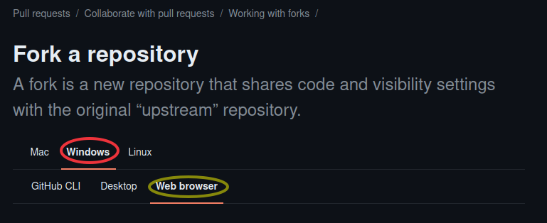

### 1.2 Criar *branch*

Crie uma *branch* para acomodar suas alterações. Entre nas pastas criadas no processo de clonagem do *fork* e rode os comandos abaixo:

```
git checkout -b atualizar_pacotes
```
Verifique que agora o repositório tem uma nova *branch*:
```
git branch
```
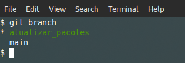

## 2. Editar os arquivos necessários para atualizar os pacotes

Entre nas pastas criadas no processo de clonagem dos repositórios e procure pelos arquivos, conforme segue. Os passos **2.1**, **2.2**, **2.3** e **2.4** podem ser realizados fora da ordem, pois os repositórios não possuem, necessariamente, todos esses tipos de arquivos.

**DICA**: Para todos os pacotes que estão nos arquivos **Dockerfile** e **requirements.txt**, é possível utilizar o [site com o índice de pacotes Python](https://pypi.org/) para realizar buscas e verificar os dados dos pacotes, tais como: versão, data da atualização, etc.

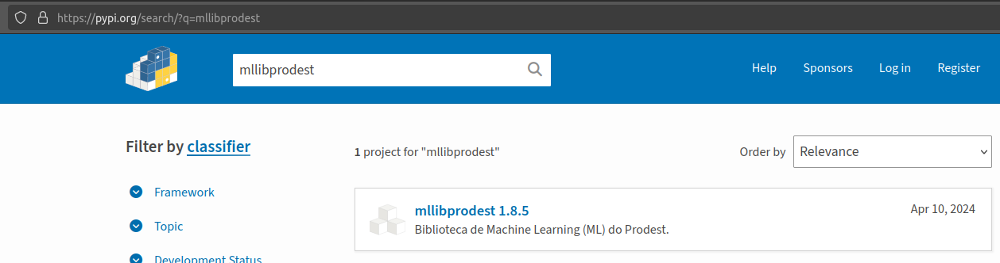

### 2.1 Editar Dockerfiles

Entre na pasta/subpastas criadas no processo de clonagem do *fork* do repositório da Stack; procure pelos arquivos chamados 'Dockerfile'; edite e retire todas as versões dos pacotes. Deixe somente os nomes dos pacotes.

**DICA**: Procure por todas as linhas que começam com **RUN** para encontrar os referidos pacotes. Pode acontecer de ter uma quebra de linha "\\" e possuir pacotes na linha seguinte.

- Exemplo de Dockerfile com as versões dos pacotes:

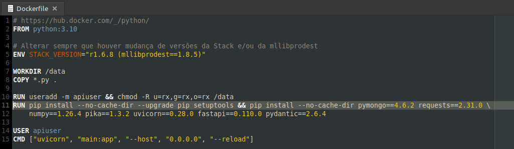

Supondo que o pacote esteja descrito como **pymongo==4.6.2**, apague a parte da versão **==4.6.2** e deixe somente o nome do pacote: **pymongo**.

- Exemplo de Dockerfile **SEM** as versões dos pacotes:

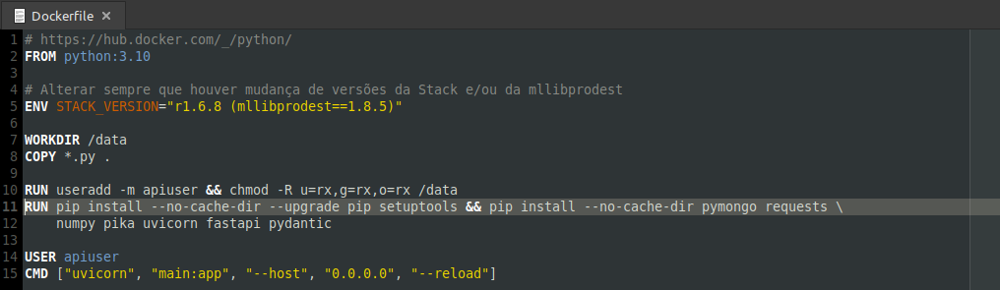

Faça isso para todos os arquivos **Dockerfile** (**EXCETO** o Dockerfile que está dentro da pasta **temp_builder**).

### 2.2 Editar o arquivo do Docker compose

Entre na pasta **stack** (encontra-se dentro da pasta criada no processo de clonagem do fork do repositório da Stack) e abra o arquivo **docker-compose.yml**. Procure pelas linhas iniciadas por **image:** que possuam um comentário acima delas iniciado por **https://hub.docker.com**. Para cada uma das linha encontradas, faça o seguinte:

- Acesse o link que está no comentário, no exemple da imagem abaixo é **https://hub.docker.com/_/mongo** e procure por uma versão mais atualizada para a imagem Docker descrita na linha iniciada por **image:**.

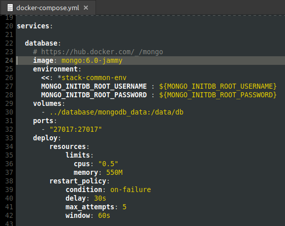


Utilize como base o nome da imagem, e sufixos como por exemplo **jammy**, conforme exemplo, e faça um filtro por *tags* para encontrar a imagem mais atualizada.

**ATENÇÃO**: Esse processo é delicado e requer atenção, pois deve ser evitado obter imagens que são *release candidate* (rc, RC), *beta*, etc. Sempre escolha imagens com versões estáveis.

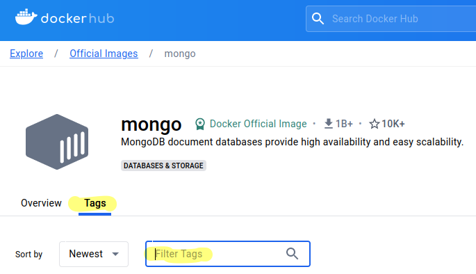

Para exemplificar, se for filtrado por **jammy**, poderia ser escolhida a imagem conforme figura abaixo, pois está mais próxima da imagem que se deseja atualizar.

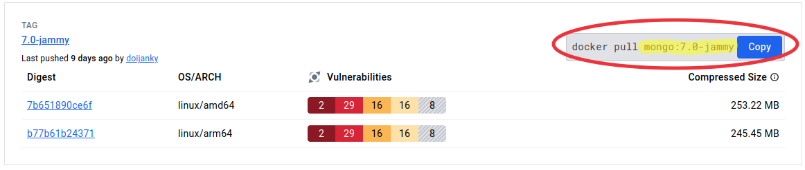

Altere a versão da imagem para a nova versão, conforme nome da imagem destacada na figura acima. Por exemplo, substitua da seguinte forma:

- **image: mongo:6.0-jammy** por **image: mongo:7.0-jammy**

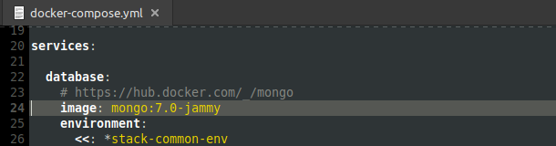

Faça o mesmo processo para as outras imagens que constam no arquivo **docker-compose.yml**. 

**ATENÇÃO**: Parar evitar a "quebra" dos componentes da Stack, **JAMAIS** deixe as versões das imagens apontadas para *latest*! Sempre coloque a versão específica que desejar.

### 2.3 Editar requirements

Entrar na pasta criada no processo de clone do modelo de teste; procurar por todos os arquivos **requirements.txt** e também retirar as versões dos pacotes.

- Exemplo de requirements.txt com as versões dos pacotes:

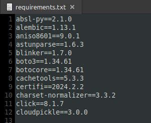

- Exemplo de requirements.txt **SEM** as versões dos pacotes:

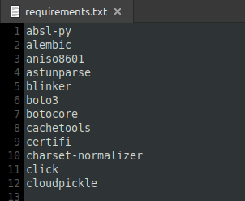

### 2.4 Editar pyproject.toml

Procure pelo arquivo **pyproject.toml** que está dentro da pasta criada no processo de clonagem do *fork* do repositório da **mllibprodest** e altere de acordo com os exemplos, da seguinte forma:

- Exemplo de arquivo pyproject.toml com as versões dos pacotes

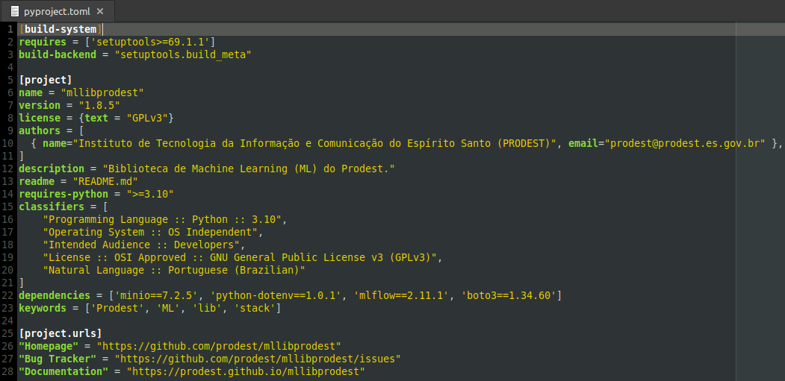

- Retire a versão do Setup tools da linha: **requires = ['setuptools>=69.1.1']** deve ficar assim: **requires = ['setuptools']**

- Altere a versão da mllibprodest somando 1 no último campo numérico na linha: **version = "1.8.5"**, que nesse exemplo ficará assim: **version = "1.8.6"**

- Retire as versões dos pacotes que constam na linha: **dependencies = ['minio==7.2.5', 'python-dotenv==1.0.1', ...]**. Deve ficar assim: **dependencies = ['minio', 'python-dotenv', ...]**

Depois das alterações realizadas, o arquivo deverá ficar parecido com a imagem abaixo.

- Exemplo de arquivo pyproject.toml **SEM** as versões dos pacotes e com a versão da mllibprodest alterada

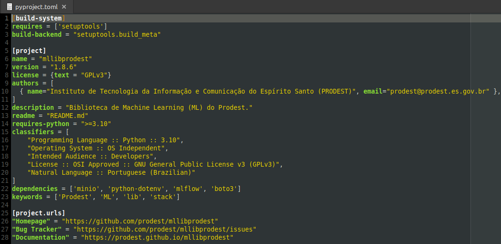

## 3. Faça o *build* da mllibprodest

Caso os pacotes da **mllibprodest** precisarem ser atualizados, será preciso fazer o *build* da mllibprodest para gerar um pacote instalável pelo **pip**. Siga os passos abaixo:

### 3.1 Crie uma pasta para realizar o *build*

Crie uma pasta, com o nome que desejar, e copie a pasta criada no processo de clonagem do *fork* do repositório da mllibprodest para dentro dela.

### 3.2 Crie um ambiente virtual Python e ative-o

Abra um *prompt* de comando e entre na pasta criada no **passo 3.1**; depois entre na pasta do *fork* do repositório da mllibprodest.

Crie o ambiente virtual de acordo com a versão requerida pela lib (nesse exemplo é 3.10, veja na linha **requires-python = ">=3.10"** do arquivo **pyproject.toml**).
```bash
python3.10 -m venv env
```
Ative o ambiente virtual.
```bash
source env/bin/activate
```

### 3.3 Faça o *'build'* da biblioteca
Antes de rodar os comandos para construir o pacote com a biblioteca, atualize o *pip*, *build* e *twine*. 

```bash
python -m pip install --upgrade pip build twine
```

De dentro da pasta criada no processo de clonagem do *fork* do repositório (mllibprodest) que está dentro da pasta criada no **passo 3.1**, rode o comando abaixo.

- Constrói o pacote e salva na pasta *'dist'*.
```bash
python -m build
```

**ATENÇÃO**: O arquivo gerado nesse passo será utilizado no **passo 4.4**.

## 4. Preparar as pastas

Antes de fazer o deploy da Stack, é necessário preparar as pastas e colocá-las de forma que facilitem o processo.

### 4.1 Crie uma pasta para realizar os testes

Para não desorganizar os arquivos criados nas clonagens dos *forks*, pois no final do processo será necessário fazer um *commit* dos arquivos alterados, crie uma pasta para testes separada.

### 4.2 Copie a pasta da Stack

Copie a pasta criada no processo de clonagem do *fork* do repositório da Stack para dentro da pasta criada para os testes no **passo 4.1**.

### 4.3 Copie a pasta publicar

Copie a pasta **publicar**, que está dentro da pasta criada no processo de clonagem do *fork* do repositório do modelo de teste, para dentro da pasta com os arquivos da Stack que foi copiada para a pasta de teste no **passo 4.2**.

### 4.4 Copie a lib para o modelo-teste

Se a **mllibprodest** foi atualizada, conforme **passo 3**, é mandatório que o modelo de teste seja atualizado com a nova versão da lib.

Para atualizar o modelo de teste com a versão atualizada da **mllibprodest**, copie o arquivo **mllibprodest-x.y.z-py3-none-any.whl** (onde x.y.z é a versão da mllibprodest), que foi gerado no **passo 3.3** e está dentro da pasta **dist**, para as pastas abaixo, que estão dentro da pasta **publicar** que foi copiada conforme **passo 4.3**:

- publicar/worker_pub
- publicar/worker_retrain

Além disso, edite os arquivos **requirements.txt** constantes nas duas pastas (worker_pub e worker_retrain) e substitua a linha **mllibprodest** pelo nome do arquivo gerado pelo *build*, que nesse exemplo é **mllibprodest-1.8.6-py3-none-any.whl**, conforme imagens abaixo:

- Antes:

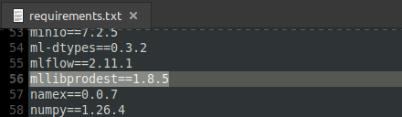

- Depois:

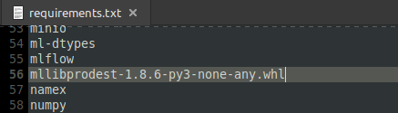

### 4.5 Apague a pasta do *build* da mllibprodest

Apague a pasta criada para o *build* da mllibprodest no **passo 3.1**.

### 4.6 Confira a organização das pastas

Após a cópia das pastas, confira se a organização ficou correta. Supondo que o nome da pasta de testes ficou como '**teste**' e que foi colocado um prefixo '**fork_**' no *fork* do repositório da Stack, a organização ficaria assim:

Perceba que a pasta **publicar** foi copiada para dentro da pasta da Stack, conforme **passo 4.3**.

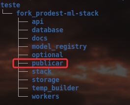

Caso tenha sido atualizada, observe o destaque para o arquivo da mllibprodest dentro das pastas dos ***workers* pub e retrain**, que estão dentro da pasta **publicar**, conforme instruído no **passo 4.4**.

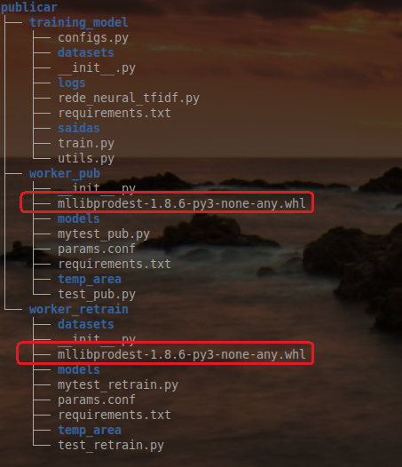

## 5. Subir a Stack para realizar testes

Após a preparação dos arquivos e pastas, conforme os passos anteriores, suba a Stack de ML para que sejam instaladas as últimas versões dos pacotes e/ou as versões das imagens que foram alteradas no arquivo **docker-compose.yml**.

Para subir a Stack de ML:

- Abra um **prompt** de comando;
- Entre na pasta com o *fork* da Stack que está dentro da pasta preparada para os testes no **passo 4**;
- Utilize os passos descritos do README do repositório dela ([repo da Stack](https://github.com/prodest/prodest-ml-stack)) a partir do **passo 1.2**, pois o clone **NÃO** deve ser feito para que a pasta de teste seja utilizada.

No item '**1.2. Construir as imagens e subir o ambiente**', responda às perguntas do *script* **build.sh**, conforme abaixo:

- Responda ***no*** para evitar clonar o modelo-teste novamente;
- Responda ***yes*** para utilizar a pasta **publicar** com os arquivos alterados.

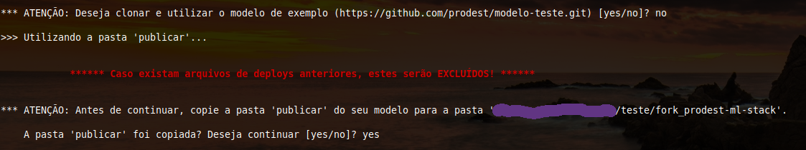

Continue seguindo as intruções do README até que a Stack esteja funcionando corretamente.

**ATENÇÃO**: Caso aconteçam erros na instalação dos pacotes o processo de *build* falhará. Verifique as mensagens de erros, identifique e acerte os erros; volte para o passo '**1.2. Construir as imagens e subir o ambiente**' do README.

**ATENÇÃO**: Se você fizer alguma alteração nos arquivos da pasta de teste, não esqueça de atualizar os das pastas dos *forks* dos repositórios para que o *commit* seja realizado com os arquivos atualizados.

## 6. Realizar os testes

Depois de realizar o **passo 5** acima, com sucesso, inclusive com o modelo de teste treinado e registrado (conforme **passos 2 e 3.2** do [repo da Stack](https://github.com/prodest/prodest-ml-stack)) já é um forte indício de que a atualização dos pacotes ocorreu com sucesso!

### 6.1 Teste de *stress* simples

No repositório da Stack de ML possui um passo, para aquele contexto é opcional, que deve ser utilizado aqui para realizar um teste de *stress* simples dos componentes da Stack.

- Para realizar este teste siga as instruções do **passo 5.3** do [repo da Stack](https://github.com/prodest/prodest-ml-stack).

### 6.2 Teste de retornos da API da Stack

O teste de retorno verifica se a API da Stack, após a atualização, continua retornando valores esperados e corretos. O *script* para realização deste teste está junto com o *script* para realização do teste de *stress* simples (dentro da pasta **optional**).

- Continue no ambiente virtual Python criado, conforme **passo 5.3** do [repo da Stack](https://github.com/prodest/prodest-ml-stack)

- Reinicie o container da API.

```bash
docker restart stack-api-1
```

- Execute o *script* **return_tests.py**.

```
python return_tests.py
```
Confira a saida do *script* na tela para saber se está tudo correto.

## 7. Obter as versões dos pacotes que foram atualizados

Depois de tudo testado e funcionando, obtenha as versões dos pacotes que foram instaladas no processo de *build* da Stack de ML.

### 7.1 - Dockerfiles e requirements

Para obter as versões dos pacotes instalados através das modificações nos arquivos Dockerfile e requirements, será necessário verificar nos containers abaixo:

| Componente  | Nome do container | Nome do arquivo com as versões |
| ------------- | ------------- | --------------------------------- |
| API  | stack-api-1  | req_api.txt |
| Model Registry  | stack-model-registry-1 | req_model_reg.txt |
| Worker Training  | stack-mltraining-model-1 | req_worker_train.txt |
| Worker PUB  | stack-worker-pub-1 | req_worker_pub.txt |
| Worker Retrain  | stack-worker-retrain-1 | req_worker_retrain.txt |

Abra um *prompt* de comando; entre na pasta de **onde o *build* da Stack foi realizado** e rode os comandos a seguir para obter as versões.

```bash
docker start stack-api-1 && docker exec stack-api-1 pip list --format=freeze > req_api.txt
```
```bash
docker start stack-model-registry-1 && docker exec stack-model-registry-1 pip list --format=freeze > req_model_reg.txt
```
```bash
docker start stack-mltraining-model-1 && docker exec stack-mltraining-model-1 pip list --format=freeze > req_worker_train.txt && docker stop stack-mltraining-model-1
```
```bash
docker start stack-worker-pub-1 && docker exec stack-worker-pub-1 pip list --format=freeze > req_worker_pub.txt
```
```bash
docker start stack-worker-retrain-1 && docker exec stack-worker-retrain-1 pip list --format=freeze > req_worker_retrain.txt && docker stop stack-worker-retrain-1
```

Caso ocorram com sucesso, as execuções dos comandos acima gerarão os arquivos conforme figura abaixo.

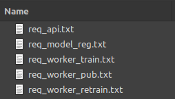

### 7.2 - Pacotes da mllibprodest

Se os pacotes da mllibprodest foram atualizados, obtenha as versões conforme instruções abaixo:

- Entre na pasta **publicar** que foi copiada para dentro da pasta de onde a Stack foi construida.


- Entre na pasta **worker_pub** (que está dentro da pasta **publicar**).

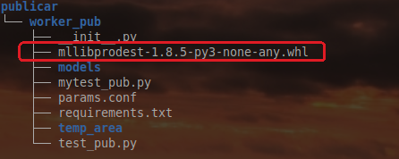

- Crie e ative um ambiente virtual Python, conforme instruções: [Linux e Windows (escolha o sistema na página)](https://packaging.python.org/en/latest/guides/installing-using-pip-and-virtual-environments/#creating-a-virtual-environment);

- Atualize o pip e o setuptools.

```bash
pip install --upgrade pip setuptools
```

- Instale a mllibprodest diretamente do pacote **whl** (destaque na imagem anterior). Substitua **x.y.z** pela versão nova versão da mllibprodest.

```bash
pip install mllibprodest-x.y.z-py3-none-any.whl
```

- Obtenha a lista de pacotes. Será gerado um arquivo chamado **req_mllib.txt**.

```bash
pip list --format=freeze > req_mllib.txt
```
**DICA**: Para facilitar, se preferir, copie este arquivo para mesma pasta dos arquivos gerados no **passo 7.1**.

## 8. Atualizar os arquivos dos *forks*

De posse dos arquivos gerados no **passo 7**, faça o inverso do que foi feito nos **passos 2.1, 2.3 e 2.4**. Em suma, retorne com as versões que foram instaladas no *build* da Stack.

Por exemplo, para o pacote rich:

| Antes | Depois |
| ------------- | ------------- |
| rich  | rich==13.7.1  |

As versões atualizadas dos pacotes devem ser extraídas dos arquivos gerados, conforme correspondência na tabela abaixo:

| Componente                     | Arquivo para atualizar| Arquivo com as versões novas|
|--------------------------------| ------------- | --------------------------------- |
| API (Stack)                    | Dockerfile | req_api.txt |
| Model Registry (Stack)         | Dockerfile | req_model_reg.txt |
| Worker PUB (Stack)             | Dockerfile | req_worker_pub.txt |
| Worker Training (modelo-teste) | requirements.txt | req_worker_train.txt |
| Worker PUB (modelo-teste)      | requirements.txt | req_worker_pub.txt |
| Worker Retrain (modelo-teste)  | requirements.txt | req_worker_retrain.txt |
| mllibprodest                   | pyproject.toml | req_mllib.txt |

**ATENÇÃO**:

- No caso específico da **API**, edite o arquivo **Dockerfile** e atualize a linha **ENV STACK_VERSION="ra.b.c (mllibprodest==x.y.z)"**, somando 1 ao terceiro número da versão da Stack (representado por c em ra.b.c). Atualize também x.y.z com a nova versão da **mllibprodest**.

- No caso específico da **mllibprodest** (caso tenha sido atualizada), edite o arquivo **pyproject.toml** e atualize a linha **version = "x.y.z"** com a nova versão da **mllibprodest**.

## 9. Subir a Stack (novamente) para realizar testes

Após a atualização das versões dos pacotes, teste **novamente** a Stack, que agora possui os arquivos com as versões fixadas. Proceda da seguinte forma:

- Destrua a Stack, conforme **passo 7** descrito no [repo da Stack](https://github.com/prodest/prodest-ml-stack).
- Apague a pasta que foi criada para a realização dos testes.
- Execute novamente os **passos 3, 4, 5 e 6**, para construir e testar a Stack.
- Destrua a Stack.

## 10. Solicitar a inclusão das atualizações no repositório remoto

Com os arquivos dos *forks* dos repositórios atualizados e a Stack testada novamente, crie um *pull request* para que os pacotes sejam atualizados nos repositórios remotos.

**ATENÇÃO**: Repita os comandos abaixo para cada repositório que foi atualizado.

### 10.1 Faça o *commit* e *push*

Antes de realizar o *pull request* faça *commit* e *push* das suas alterações, através da sua ferramenta de programação ou através dos comandos abaixos, efetuados via *prompt* de comando dentro das pastas dos *forks* dos repositórios:

```
git add .
git commit -m "MENSAGEM INFORMATIVA"
git push --set-upstream origin atualizar_pacotes
```
Onde: **"MENSAGEM INFORMATIVA"** é uma mensagem que descreva o *commit* realizado.

### 10.2 Crie um *pull request*

Siga as instruções no [tutorial oficial do Github](https://docs.github.com/en/pull-requests/collaborating-with-pull-requests/proposing-changes-to-your-work-with-pull-requests/creating-a-pull-request) para realizar o ***pull request***. Escolha a plataforma e maneira que achar mais adequadas para o seu caso.

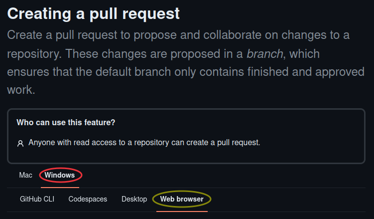

**ATENÇÃO**: Os *pull requests* são verificados e aprovados pelos donos dos repositórios oficiais, portanto as atualizações propostas não serão aplicadas automaticamente e podem levar alguns dias para acontecerem.